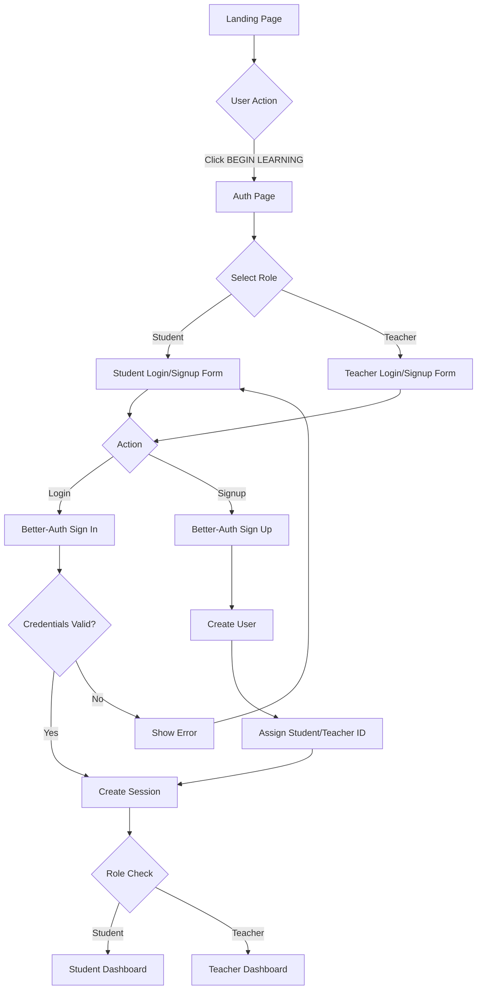

# LearnFlow Authentication Implementation Plan

## Design Requirements

### User Roles
1. **Student** - Can:
   - Submit questions to agents
   - View personal mastery dashboard
   - Track learning progress
   - Complete exercises

2. **Teacher** - Can:
   - Everything students can do
   - View Teacher HUD (student struggle detection)
   - See all students' progress
   - Access admin analytics

### UI/UX Design (Flash UI Aesthetic)

#### Login/Signup Page Layout
```
┌─────────────────────────────────────────────────┐
│  LEARNFLOW SECURITY PROTOCOL                    │
│                                                  │
│  ┌──────────────────────────────────────────┐  │
│  │  [STUDENT]  [TEACHER]  ← Role Toggle     │  │
│  └──────────────────────────────────────────┘  │
│                                                  │
│  ┌──────────────────────────────────────────┐  │
│  │  Email:    [_____________________]        │  │
│  │  Password: [_____________________]        │  │
│  │                                            │  │
│  │  [ AUTHENTICATE ]  [ CREATE ACCOUNT ]     │  │
│  └──────────────────────────────────────────┘  │
│                                                  │
│  > Terminal Output:                             │
│  security@learnflow:~$ verifying credentials... │
│  [SUCCESS] Authentication protocol initiated    │
└─────────────────────────────────────────────────┘
```

### Database Schema

```sql
-- Users table (managed by Better-Auth)
CREATE TABLE users (
  id TEXT PRIMARY KEY,
  email TEXT UNIQUE NOT NULL,
  name TEXT,
  emailVerified BOOLEAN DEFAULT FALSE,
  image TEXT,
  createdAt TIMESTAMP DEFAULT CURRENT_TIMESTAMP,
  updatedAt TIMESTAMP DEFAULT CURRENT_TIMESTAMP,

  -- LearnFlow custom fields
  role TEXT NOT NULL DEFAULT 'student', -- 'student' | 'teacher' | 'admin'
  studentId TEXT UNIQUE, -- Generated for students
  teacherId TEXT UNIQUE  -- Generated for teachers
);

-- Sessions table (Better-Auth)
CREATE TABLE sessions (
  id TEXT PRIMARY KEY,
  expiresAt TIMESTAMP NOT NULL,
  ipAddress TEXT,
  userAgent TEXT,
  userId TEXT NOT NULL REFERENCES users(id),
  FOREIGN KEY (userId) REFERENCES users(id) ON DELETE CASCADE
);

-- Accounts table (for OAuth)
CREATE TABLE accounts (
  id TEXT PRIMARY KEY,
  accountId TEXT NOT NULL,
  providerId TEXT NOT NULL,
  userId TEXT NOT NULL REFERENCES users(id),
  accessToken TEXT,
  refreshToken TEXT,
  idToken TEXT,
  expiresAt TIMESTAMP,
  FOREIGN KEY (userId) REFERENCES users(id) ON DELETE CASCADE
);
```

### Authentication Flow



### Implementation Steps

#### Phase 1: Database Setup (Prisma)
1. Install Prisma
2. Create schema with user roles
3. Generate migrations
4. Seed database with test users

#### Phase 2: Better-Auth Setup
1. Configure Better-Auth with email/password
2. Add custom role field
3. Generate student/teacher IDs on signup
4. Setup session management

#### Phase 3: Auth UI Components
1. Create `AuthPage.tsx` with Flash UI styling
2. Add role toggle (Student/Teacher)
3. Login form with terminal output
4. Signup form with role selection
5. Loading states with hacker terminal animation

#### Phase 4: Protected Routes
1. Middleware to check authentication
2. Role-based access control
3. Redirect logic (unauthenticated → /auth)
4. Dashboard access by role

#### Phase 5: Backend Integration
1. Pass userId/studentId to all agent requests
2. Progress Tracker uses real student IDs
3. Teacher Dashboard queries all student progress

## File Structure

```
mystery-skils-app-ui/
├── prisma/
│   ├── schema.prisma          # Database schema
│   └── migrations/             # DB migrations
├── lib/
│   ├── auth.ts                 # Better-Auth server config
│   ├── auth-client.ts          # Better-Auth client hooks
│   └── db.ts                   # Prisma client
├── app/
│   ├── api/
│   │   └── auth/
│   │       └── [...all]/route.ts  # Better-Auth API
│   ├── auth/
│   │   └── page.tsx            # Auth page (login/signup)
│   ├── dashboard/
│   │   └── page.tsx            # Student dashboard
│   └── teacher/
│       └── page.tsx            # Teacher dashboard
├── components/
│   ├── auth/
│   │   ├── AuthForm.tsx        # Main auth component
│   │   ├── RoleToggle.tsx      # Student/Teacher toggle
│   │   ├── LoginForm.tsx       # Login fields
│   │   └── SignupForm.tsx      # Signup fields
│   └── ui/
│       └── TerminalOutput.tsx  # Hacker terminal for auth logs
└── middleware.ts               # Route protection

.env
DATABASE_URL=postgresql://...
BETTER_AUTH_SECRET=...
NEXT_PUBLIC_API_URL=http://localhost:4000
```

## Code Snippets

### 1. Prisma Schema
```prisma
// prisma/schema.prisma

generator client {
  provider = "prisma-client-js"
}

datasource db {
  provider = "postgresql"
  url      = env("DATABASE_URL")
}

model User {
  id            String    @id @default(cuid())
  email         String    @unique
  name          String?
  emailVerified Boolean   @default(false)
  image         String?
  createdAt     DateTime  @default(now())
  updatedAt     DateTime  @updatedAt

  // LearnFlow fields
  role          String    @default("student") // student | teacher
  studentId     String?   @unique
  teacherId     String?   @unique

  sessions      Session[]
  accounts      Account[]
}

model Session {
  id         String   @id @default(cuid())
  userId     String
  expiresAt  DateTime
  ipAddress  String?
  userAgent  String?

  user       User     @relation(fields: [userId], references: [id], onDelete: Cascade)
}

model Account {
  id            String   @id @default(cuid())
  userId        String
  accountId     String
  providerId    String
  accessToken   String?
  refreshToken  String?
  idToken       String?
  expiresAt     DateTime?

  user          User     @relation(fields: [userId], references: [id], onDelete: Cascade)
}
```

### 2. Better-Auth Config
```typescript
// lib/auth.ts

import { betterAuth } from "better-auth"
import { prismaAdapter } from "better-auth/adapters/prisma"
import { prisma } from "./db"

export const auth = betterAuth({
  database: prismaAdapter(prisma, {
    provider: "postgresql"
  }),
  emailAndPassword: {
    enabled: true,
    requireEmailVerification: false,
  },
  user: {
    additionalFields: {
      role: {
        type: "string",
        defaultValue: "student",
      },
      studentId: {
        type: "string",
        required: false,
      },
      teacherId: {
        type: "string",
        required: false,
      }
    }
  },
  hooks: {
    after: [{
      matcher(context) {
        return context.path === "/sign-up/email"
      },
      async handler(context) {
        // Generate student/teacher ID on signup
        const user = context.user
        const role = context.body?.role || "student"

        if (role === "student") {
          user.studentId = `STU-${Date.now()}-${Math.random().toString(36).substr(2, 9)}`
        } else if (role === "teacher") {
          user.teacherId = `TCH-${Date.now()}-${Math.random().toString(36).substr(2, 9)}`
        }

        return { user }
      }
    }]
  }
})
```

### 3. Auth Page Component
```typescript
// app/auth/page.tsx

"use client"

import { useState } from "react"
import { signIn, signUp } from "@/lib/auth-client"
import { useRouter } from "next/navigation"

export default function AuthPage() {
  const [role, setRole] = useState<"student" | "teacher">("student")
  const [mode, setMode] = useState<"login" | "signup">("login")
  const [email, setEmail] = useState("")
  const [password, setPassword] = useState("")
  const [name, setName] = useState("")
  const [loading, setLoading] = useState(false)
  const [logs, setLogs] = useState<string[]>([])
  const router = useRouter()

  const addLog = (message: string) => {
    setLogs(prev => [...prev, `security@learnflow:~$ ${message}`])
  }

  const handleAuth = async () => {
    setLoading(true)
    addLog(mode === "login" ? "verifying credentials..." : "initiating account creation...")

    try {
      if (mode === "login") {
        const result = await signIn.email({ email, password })
        if (result.data) {
          addLog("[SUCCESS] Authentication confirmed")
          addLog("Loading secure dashboard...")

          const userRole = result.data.user.role
          router.push(userRole === "teacher" ? "/teacher" : "/dashboard")
        } else {
          addLog("[ERROR] Authentication failed - invalid credentials")
        }
      } else {
        const result = await signUp.email({
          email,
          password,
          name: name || email.split("@")[0],
          role,
        })

        if (result.data) {
          addLog("[SUCCESS] Account created successfully")
          addLog(`[INFO] ${role.toUpperCase()} ID: ${result.data.user[role === "student" ? "studentId" : "teacherId"]}`)
          addLog("Redirecting to dashboard...")

          router.push(role === "teacher" ? "/teacher" : "/dashboard")
        } else {
          addLog("[ERROR] Account creation failed")
        }
      }
    } catch (error) {
      addLog(`[ERROR] ${error.message}`)
    } finally {
      setLoading(false)
    }
  }

  return (
    <div className="min-h-screen bg-[#010101] flex items-center justify-center p-4">
      <div className="max-w-md w-full glass-card p-8">
        <h1 className="text-2xl font-black text-[#00ffcc] mb-6 tracking-wider">
          LEARNFLOW SECURITY PROTOCOL
        </h1>

        {/* Role Toggle */}
        <div className="flex gap-2 mb-6">
          <button
            onClick={() => setRole("student")}
            className={`flex-1 py-2 px-4 font-bold transition ${
              role === "student"
                ? "bg-[#00ffcc] text-black"
                : "bg-transparent text-[#00ffcc] border border-[#00ffcc]"
            }`}
          >
            STUDENT
          </button>
          <button
            onClick={() => setRole("teacher")}
            className={`flex-1 py-2 px-4 font-bold transition ${
              role === "teacher"
                ? "bg-[#00ffcc] text-black"
                : "bg-transparent text-[#00ffcc] border border-[#00ffcc]"
            }`}
          >
            TEACHER
          </button>
        </div>

        {/* Auth Form */}
        <div className="space-y-4">
          {mode === "signup" && (
            <div>
              <label className="block text-[#00ffcc] text-xs mb-1">NAME</label>
              <input
                type="text"
                value={name}
                onChange={(e) => setName(e.target.value)}
                className="w-full bg-black border border-[#00ffcc]/30 px-4 py-2 text-white font-mono"
                placeholder="Enter your name"
              />
            </div>
          )}

          <div>
            <label className="block text-[#00ffcc] text-xs mb-1">EMAIL</label>
            <input
              type="email"
              value={email}
              onChange={(e) => setEmail(e.target.value)}
              className="w-full bg-black border border-[#00ffcc]/30 px-4 py-2 text-white font-mono"
              placeholder="your@email.com"
            />
          </div>

          <div>
            <label className="block text-[#00ffcc] text-xs mb-1">PASSWORD</label>
            <input
              type="password"
              value={password}
              onChange={(e) => setPassword(e.target.value)}
              className="w-full bg-black border border-[#00ffcc]/30 px-4 py-2 text-white font-mono"
              placeholder="••••••••"
            />
          </div>

          <div className="flex gap-2">
            <button
              onClick={handleAuth}
              disabled={loading}
              className="flex-1 bg-[#00ffcc] text-black py-3 font-black hover:bg-white transition disabled:opacity-50"
            >
              {loading ? "PROCESSING..." : mode === "login" ? "AUTHENTICATE" : "CREATE ACCOUNT"}
            </button>
          </div>

          <button
            onClick={() => setMode(mode === "login" ? "signup" : "login")}
            className="w-full text-[#00ffcc] text-sm hover:underline"
          >
            {mode === "login" ? "Need an account? Sign up" : "Already have an account? Login"}
          </button>
        </div>

        {/* Terminal Output */}
        {logs.length > 0 && (
          <div className="mt-6 bg-black/60 border border-[#00ffcc]/20 p-4 font-mono text-xs text-green-400">
            {logs.map((log, i) => (
              <div key={i} className="mb-1">{log}</div>
            ))}
          </div>
        )}
      </div>
    </div>
  )
}
```

## Next Steps

1. **Install dependencies** (in progress)
2. **Setup Prisma with SQLite** (for quick development)
3. **Implement auth pages**
4. **Test login/signup flow**
5. **Connect to backend agents** (pass studentId in requests)
